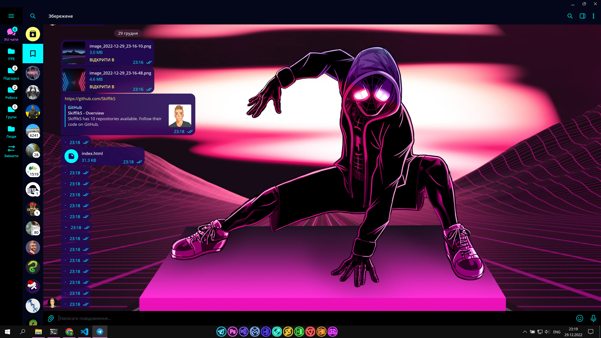

# NEON IMAGES

---

Проект створений для оформлення віндовс 10 в неоновому стилі, а саме:
1. Екран блокування


2. Робочий стіл


3. Telegram

(Для телеграму також скачана неонова тема "Vapor Neon")
https://t.me/addtheme/VaporNeon



4. Chrome
(Для оформлення хрому використано розширення "Bonjourr")
https://chrome.google.com/webstore/detail/bonjourr-%C2%B7-minimalist-sta/dlnejlppicbjfcfcedcflplfjajinajd?hl=uk


Та налаштування для хрому у вигляді додаткового CSS коду:

```css
#interface #linkblocks #linkblocks_inner .block_parent .block .l_icon_wrap 
{ 
    background: none; 
}


#interface #time #time-container #clock
{
    color: #fff;
  text-shadow:
    0 0 5px #fff,
    0 0 10px #fff,
    0 0 20px #fff,
    0 0 40px #0ff,
    0 0 80px #0ff,
    0 0 90px #0ff,
    0 0 100px #0ff,
    0 0 150px #0ff;
}

#interface #time #date
{
    color: #fff;
  text-shadow:
    0 0 5px #fff,
    0 0 10px #fff,
    0 0 20px #fff,
    0 0 40px #0ff,
    0 0 80px #0ff,
    0 0 90px #0ff,
    0 0 100px #0ff,
    0 0 150px #0ff;
}

#interface #main #greetings
{
    color: #fff;
  text-shadow:
    0 0 5px #fff,
    0 0 10px #fff,
    0 0 20px #fff,
    0 0 40px #0ff,
    0 0 80px #0ff,
    0 0 90px #0ff,
    0 0 100px #0ff,
    0 0 150px #0ff;
}

#interface #current, #interface #forecast, #interface #widget
{
    color: #fff;
  text-shadow:
    0 0 5px #fff,
    0 0 10px #fff,
    0 0 20px #fff,
    0 0 40px #0ff,
    0 0 80px #0ff,
    0 0 90px #0ff,
    0 0 100px #0ff,
    0 0 150px #0ff;
}

#interface #linkblocks #linkblocks_inner .block_parent .block span
{
color: #fff;
  text-shadow:
    0 0 5px #fff,
    0 0 10px #fff,
    0 0 20px #fff,
    0 0 40px #0ff,
    0 0 80px #0ff,
    0 0 90px #0ff,
    0 0 100px #0ff,
    0 0 150px #0ff;
}

#interface #widgets #linkblocks li.block a img{
background: none;
}
```